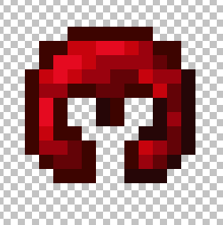
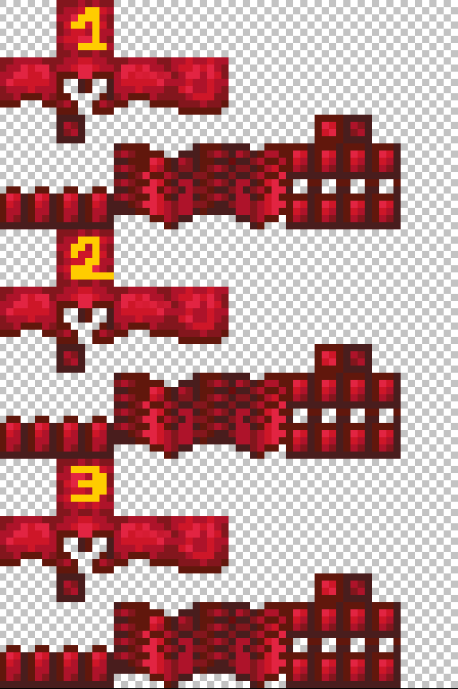
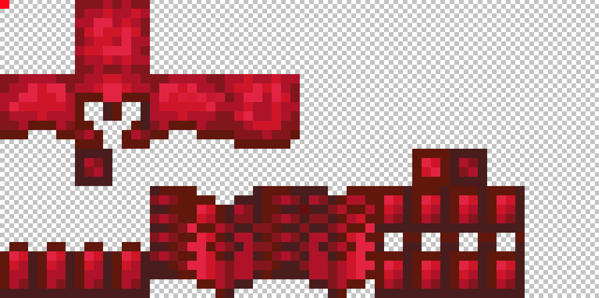

# Custom Armors

Armor has like every item a texture in the inventory and in the hand, but it also has a second texture when worn on the body. This second appearance has some limitations and requires some practice. We will use a trick with leather armor and colors.


## How to change the item appearance?

Because I'm using a simple 2d texture in the inventory, I will use the oraxen model generator. Since we use leather armor, we need to specify the overlay of a texture. That's why I wrote my texture name two times.



I also specified a RGB color: `252, 3, 28`, which is equals to in hexadecimal: `#FC031C`. It's a beautiful red but I could've used anything. 

```yaml
  displayname: "<gradient:#FA7CBB:#F14658>Ruby Helmet"
  material: LEATHER_HELMET
  color: 252, 3, 28
  Pack:
    generate_model: true
    parent_model: "item/generated"
    textures: # duplicate because we use the overlay of the leather armor
      - default/armors/ruby_helmet
      - default/armors/ruby_helmet
```


You can use [this tool](https://www.rapidtables.com/convert/color/index.html) to convert colors from RGB to hex and vice versa


## How to change the body appearance?

Now the fun begins. We're going to use a vanilla shader to associate an armor style with a specific color. I warmly thank Ancientkingg for developing the shader used by Oraxen.

### 1\) Create your textures

You'll have to create two textures for your armor. You can download the ruby example here:  
[https://oraxen.com/resources/armor\_rest.png](https://oraxen.com/resources/armor_rest.png)  
[https://oraxen.com/resources/armor\_leggings.png](https://oraxen.com/resources/armor_leggings.png)

#### One for the leggings \(40x32\):


#### **One for the rest of the armor \(64x32\):**


#### If you want to animate your armor, you can repeat the texture multiple time \(one time per frame\). To get about one second, you'ld need 24 frames. Here is an example with 3 frames:



### 2\) Add a recognition pixel at the top left of your texture

When we created our item, we chosed the color `252, 3, 28`, which is equals to in hexadecimal: `#FC031C`, it's time to tell to our shader to recognize this color. Just add a pixel with this exact color at the top left of your body textures. This shoud look like that: 




You can also add another pixel to create emitive textures, but I'll explain it later.


### 3\) Name your textures correctly

To get your textures registered correctly, their name need to contain the string  `armor_layer_1` if this is the layer 1 and `armor_layer_2` if this is the layer 2. For example:

`ruby_armor_layer_1.png`

and

`ruby_armor_layer_1.png`

You can put them in any folder of the pack textures. ~/textures/armors is suggested.


